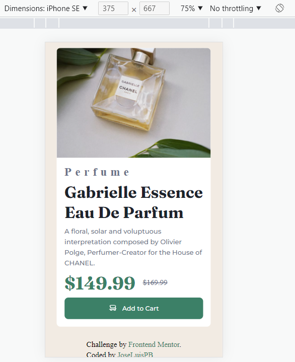

# Frontend Mentor - Product preview card component solution

This is a solution to the [Product preview card component challenge on Frontend Mentor](https://www.frontendmentor.io/challenges/product-preview-card-component-GO7UmttRfa). Frontend Mentor challenges help you improve your coding skills by building realistic projects.

## Table of contents

- [Overview](#overview)
  - [The challenge](#the-challenge)
  - [Screenshot](#screenshot)
  - [Links](#links)
- [My process](#my-process)
  - [Built with](#built-with)
  - [What I learned](#what-i-learned)
- [Author](#author)

**Note: Delete this note and update the table of contents based on what sections you keep.**

## Overview

### The challenge

Users should be able to:

- View the optimal layout depending on their device's screen size
- See hover and focus states for interactive elements

### Screenshot

Desktop solution

Mobile solution

### Links

- Solution URL: [https://github.com/JoseLuisPB/FEM-Product-Preview-card]
- Live Site URL: [https://joseluispb-frontend-mentor-product-preview-card.vercel.app/]

## My process

### Built with

- Semantic HTML5 markup
- CSS custom properties
- Flexbox
- SCSS /SASS as CSS preprocesor

### What I learned

The most important thing I have learned in this project is to display different images depending on the screen size without using javascript for that.
Another thing that I've gained with this project is getting better paying attention to details, as days goes by I realized about new thing in the picture, for example that the letters in perfume are separated, I didn't realized this at first sight nor at second, third...

## Author

- Frontend Mentor - [https://www.frontendmentor.io/profile/JoseLuisPB]

